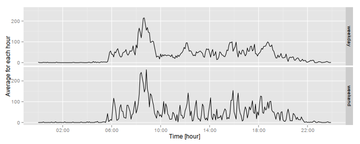

This documents aims respond some issues about [Activity monitoring data](https://d396qusza40orc.cloudfront.net/repdata%2Fdata%2Factivity.zip). The data is about personal movement using activity monitoring devices such as [Fibit](http://www.fitbit.com/), [Nike Fuelband](http://www.nike.com/us/en_us/c/nikeplus-fuelband)  or [Jawbone Up](https://jawbone.com/intl/up). The device collects data at 5 minutes intervals through out the day - consists of two months of data from an anonymous individual collect during Octover and November, 2012.

The variables included in this dataset (17,568 observations) are:

- **steps**: number of steps taking in a 5 minutes interval (missing values are code as NA)

- **date**: the date on which the measurement was taken in YYYY-MM-DD format

- **interval**: identifier for 5 minutes interval in which measurement was taken


####Loading and preprocessing the data

To begin, we read the file and store in *data* variable:


```r
data<-read.csv('activity.csv')
```

We, also, need some packages:


```r
library(stringr)
library(dplyr, warn.conflicts = FALSE)
library(ggplot2)
library(scales)
```

We need to format *data$interval* in order to see the time interval,

```r
data$interval<-str_pad(data$interval,width=4,pad=0)
data$interval<- paste(str_sub(data$interval,1,2),':',str_sub(data$interval,3,4),sep='')
data$interval<-as.factor(data$interval)
```

The resultant data is

```r
head(data,3)
```

```
##   steps       date interval
## 1    NA 2012-10-01    00:00
## 2    NA 2012-10-01    00:05
## 3    NA 2012-10-01    00:10
```


####What is mean total number of steps taken per day?

We organize the data grouping by *date*,

```r
data2<-group_by(data,date)
```

The total number of steps taken each day is showed by the follow histogram


```r
day_sum<-summarize(data2,s=sum(steps,na.rm=T))
head(day_sum)
```

```
## Source: local data frame [6 x 2]
## 
##         date     s
## 1 2012-10-01     0
## 2 2012-10-02   126
## 3 2012-10-03 11352
## 4 2012-10-04 12116
## 5 2012-10-05 13294
## 6 2012-10-06 15420
```

```r
hist(day_sum$s,breaks=20,main='Histogram of total number of steps per day',xlab='Steps')
```


Note we disconsider NA values.

The mean and median total number of steps taken per day are

```r
mean_totalstep<-mean(day_sum$s,na.rm=T)
mean_totalstep
```

```
## [1] 9354.23
```

```r
median_totalstep<-median(day_sum$s,na.rm=T)
median_totalstep
```

```
## [1] 10395
```

####What is the average daily activity pattern?

We will analyze the average number of steps taken across the 5-minute interval, on a time series plot.


```r
data3<-group_by(data,interval)
interval_mean<-summarize(data3,m=mean(steps,na.rm=T))
head(interval_mean)
```

```
## Source: local data frame [6 x 2]
## 
##   interval         m
## 1    00:00 1.7169811
## 2    00:05 0.3396226
## 3    00:10 0.1320755
## 4    00:15 0.1509434
## 5    00:20 0.0754717
## 6    00:25 2.0943396
```

```r
plot(interval_mean$interval,interval_mean$m,type='l',ylab='steps',xlab='Interval',main='Daily activity pattern')
```


Note the 5-minute interval that contains the maximum number of steps can be founded by

```r
maximum<-max(interval_mean$m)
max_interval<-interval_mean$interval[interval_mean$m==maximum]
maximum
```

```
## [1] 206.1698
```

```r
max_interval
```

```
## [1] 08:35
## 288 Levels: 00:00 00:05 00:10 00:15 00:20 00:25 00:30 00:35 00:40 ... 23:55
```
The maximum value, 206.1698113, occurs at 08:35.


####Imputing missing values

Some entrances are missing values (coded as `NA`). We want to verify the impact of missing values into the calculations; first, we calculate the total number of missing values


```r
l_na<- length(which(is.na(data)))
l_na
```

```
## [1] 2304
```

Around 13% of the data are missing values. To fill the missing values in the dataset, we replace by the mean dor 5-minute interval.

For start, we must attribute the dataset in another variable

```r
data_mod<-data
```
And replace the `NA` by the average of 5-minute interval,

```r
for(i in seq_along(data_mod$steps[which(is.na(data_mod))])){
    data_mod$steps[which(is.na(data_mod))]<-
        interval_mean$m[interval_mean$interval==data_mod$interval[which(is.na(data_mod))]]
}
head(data_mod,3)
```

```
##       steps       date interval
## 1 1.7169811 2012-10-01    00:00
## 2 0.3396226 2012-10-01    00:05
## 3 0.1320755 2012-10-01    00:10
```

Now we want verify the difference with the first histogram, organizing the data grouping by *date*,

```r
data2_mod<-group_by(data_mod,date)
```

The folow histogram shows the difference,

```r
day_sum_mod<-summarize(data2_mod,s=sum(steps,na.rm=T))
head(day_sum_mod)
```

```
## Source: local data frame [6 x 2]
## 
##         date        s
## 1 2012-10-01 10766.19
## 2 2012-10-02   126.00
## 3 2012-10-03 11352.00
## 4 2012-10-04 12116.00
## 5 2012-10-05 13294.00
## 6 2012-10-06 15420.00
```

```r
hist(day_sum_mod$s,breaks=20,main='Histogram of total number of steps per day',xlab='Steps')
```


Note the maximum frequency is around 1000, and in the last histogram, in 0 and 1000 with smaller frequency.


```r
mean_totalstep_mod<-mean(day_sum_mod$s,na.rm=T)
mean_totalstep_mod
```

```
## [1] 10766.19
```

```r
median_totalstep_mod<-median(day_sum_mod$s,na.rm=T)
median_totalstep_mod
```

```
## [1] 10766.19
```
Another difference resides on the mean and on the median: 1.0766189 &times; 10<sup>4</sup> and 1.0766189 &times; 10<sup>4</sup> *versus* 9354.2295082 and 10395 founded before.

####Are there differences in activity patterns between weekdays and weekends?

To conclude, we want to see difference in the behavior in weekdays and weekends. We create a factor to represent what kind of day 

```r
days<-c(rep(c(rep('weekday',5),rep('weekend',2)),floor(length(data_mod$steps)/7)),rep('weekday',5))
factor(days,levels=c('weekday','weekend'))
```


```r
data_mod$days<-days
head(data_mod,7)
```

```
##       steps       date interval    days
## 1 1.7169811 2012-10-01    00:00 weekday
## 2 0.3396226 2012-10-01    00:05 weekday
## 3 0.1320755 2012-10-01    00:10 weekday
## 4 0.1509434 2012-10-01    00:15 weekday
## 5 0.0754717 2012-10-01    00:20 weekday
## 6 2.0943396 2012-10-01    00:25 weekend
## 7 0.5283019 2012-10-01    00:30 weekend
```

In order to analyze the difference between weekdays and weekends, we aggregate the data by type of days, as follows


```r
steps_weekdays <- aggregate(steps ~ interval + days, data_mod, mean)
head(steps_weekdays)
```

```
##   interval    days      steps
## 1    00:00 weekday 2.25115304
## 2    00:05 weekday 0.44768439
## 3    00:10 weekday 0.17814831
## 4    00:15 weekday 0.02106187
## 5    00:20 weekday 0.01228609
## 6    00:25 weekday 1.75734971
```

```r
ggplot(data = steps_weekdays,aes(as.POSIXct(interval,format="%H:%M"),steps)) + 
    geom_line() + facet_grid(days ~ .)  +
    scale_x_datetime(labels = date_format("%H:%M"),breaks = "4 hour")+
    xlab("Time [hour]") + ylab("Average for each hour")
```


We could see a smooth increase of activity in weekends in the afternoon, with peaks 16:00.
